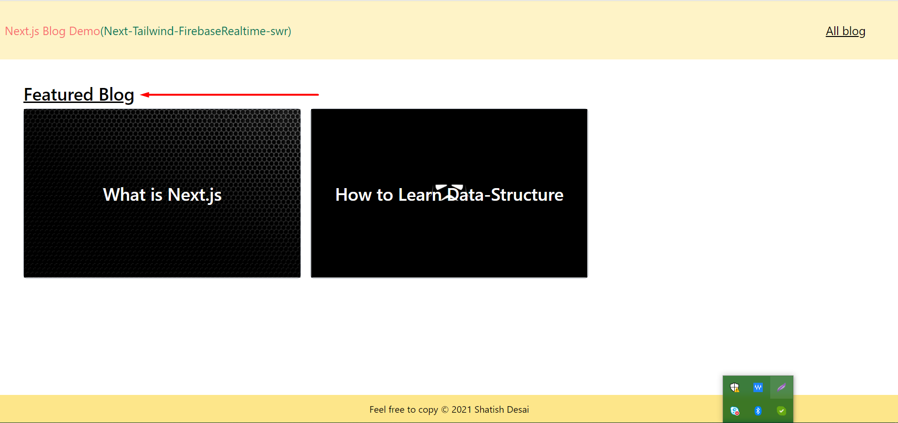
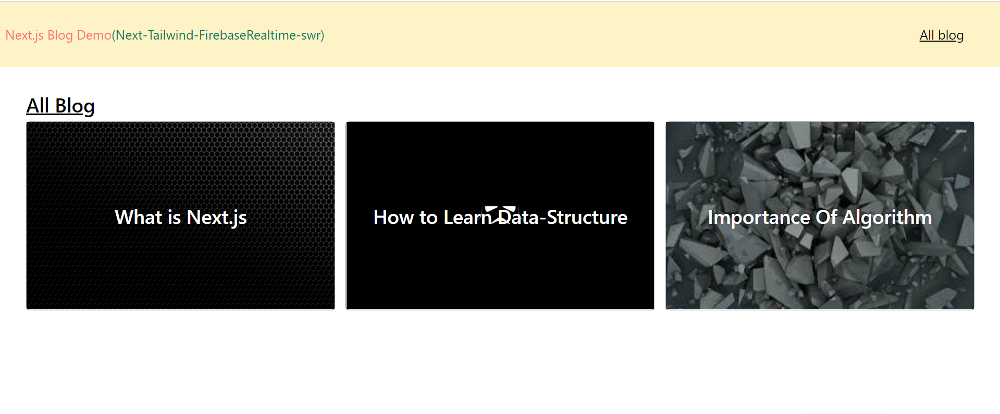

# ✔️ Next.js project with Tailwindcss | Firebase-realtime | SWR

## 🎮 Mini blog Project

## 🪔 screenshot's

### 🌟 Home page (Featured Blog)



### 🌟 All Blog



### 🌟 Blog Page


# used feature

## 🔥 SWR

```
    const { data, error } = useSWR(
    "API",
    fetcher,
    { fallbackData: initialData, refreshInterval: 1000 * 3 }
  );
```

### useSWR is a React Hook library made by Vercel. It fetches data from an API or other external source, then saves that data in a cache, and renders the data.

### https://swr.vercel.app/docs/options

<br/>
<br/>
<br/>

## 🔥 getStaticProps (Static Generation)

## 🔥 getStaticPaths (Static Generation)

## 🔥 getServerSideProps (Server-side Rendering)
